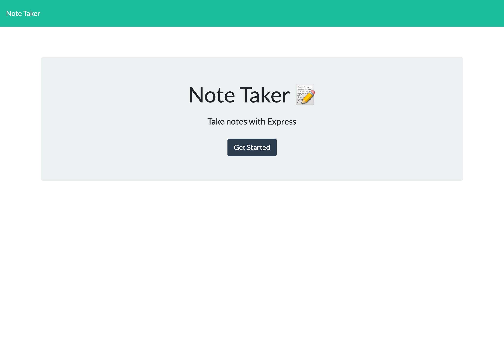
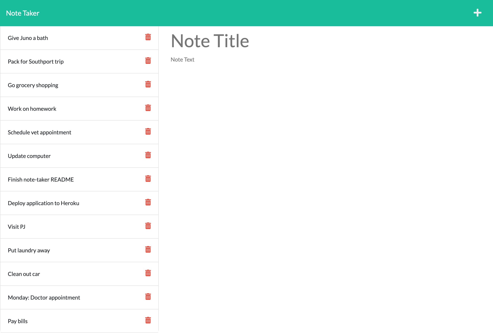

# Note Taker

## Description
The Note Taker application was created for a user to write and save notes. Once a note title and description, the user can press the 'save' icon, which will save their note to the left of the page.

## Deployment
To run the application, use ``node server``
to connect to port 3001. Type
`http://localhost:3001/` in your browser to access the application.

## Built With:
- JavaScript
- Node.js
- HTML
- CSS

## Links:
- [GitHub Repository](https://github.com/hlnicks/note-taker)
- [Heroku Repository](https://note-taker0123.herokuapp.com/)

## Screenshots

## Credits
- [Original Repo](https://github.com/coding-boot-camp/miniature-eureka)